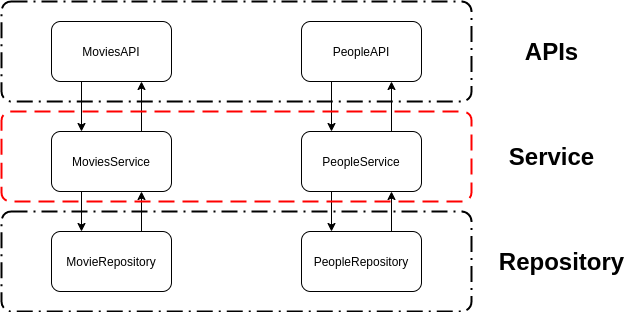

# Movie API

This is an application written in Java, using Spring Boot.

## Architeture



We have four main layers, API, Service, Repository and Models. Our models are:
  - Movie
      - title, e.g(The Avengers)
      - release date, e.g(27/04/2012)
      - director, e.g(Joss Whedon) it is a *Person*
      - cast, e.g(Robbert Downey Jr, Chris Evans, so on..) it is a list of *Person*
      - censured, e.g(true or false)

  - Person
    - name, e.g(Chris Evans)

## How to run

To run this project its pretty easy. You just have to have docker installed on your machine.

To start the **spring boot** server and **mysql**.

```shell
cd movies
docker-compose -f docker-compose.dev.yml run app
```

To run all tests

```shell
cd movies
docker-compose -f docker-compose.test.yml run app
```

## Swagger

To access swagger: http://localhost:8080/swagger-ui.html#/
